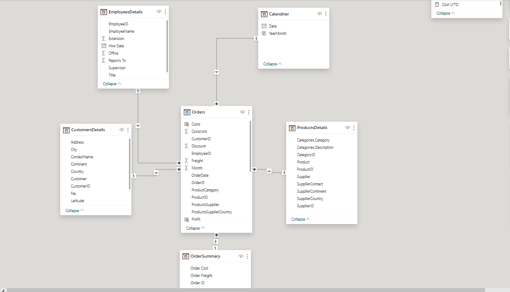
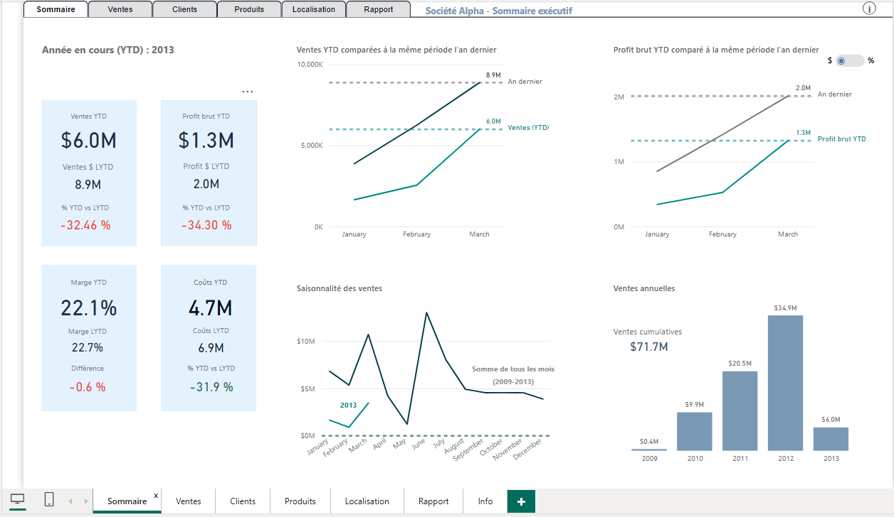
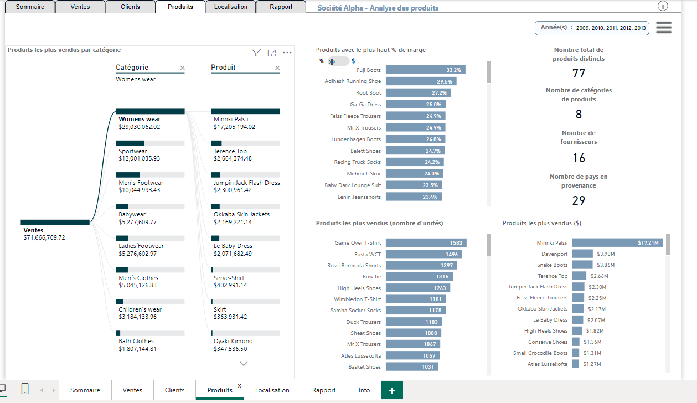
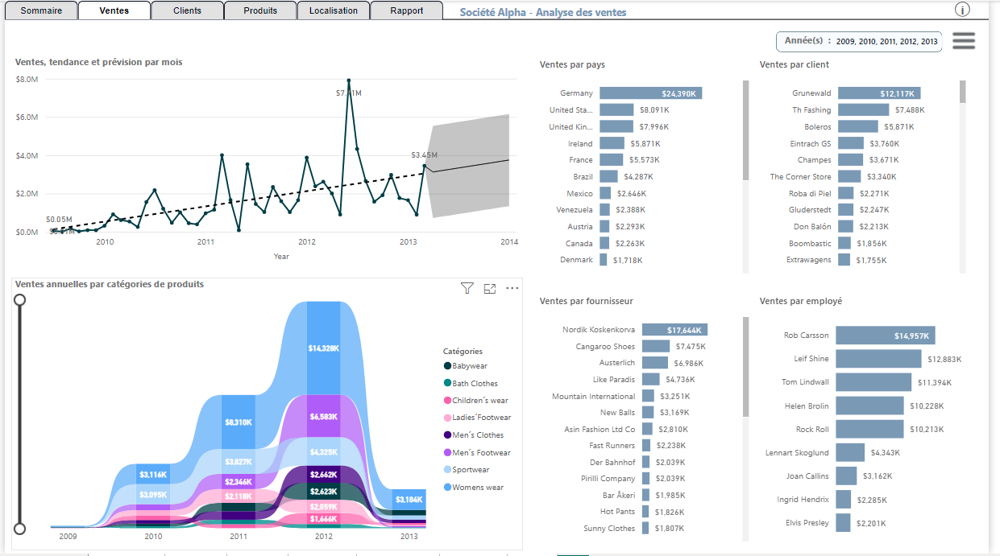
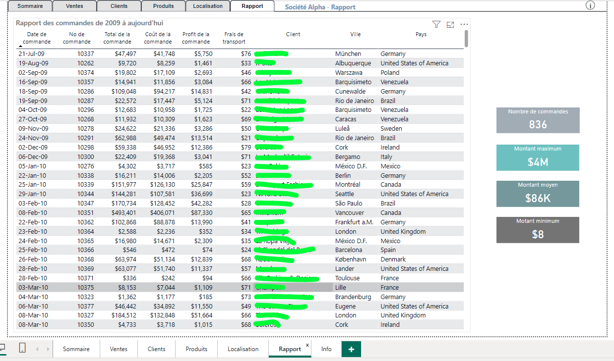

# Tableau de bord exécutif pour l'analyse des ventes

Développement d’un tableau de bord exécutif pour l’analyse des ventes. Ce projet académique a pour but de présenter la réalisation complète d’un tableau de bord. 
- Les données source sont contenues dans des fichiers Excel
- La modélisation des données est effectuée dans l’outil pour établir les liens entre les différentes tables.
- Des valeurs additionnelles de marge, profit, « year-to-date »,… sont calculées avec le langage DAX.
- Les graphiques adéquats sont choisis pour présenter les résultats pertinents

### Modélisation ###

### Sommaire exécutif ###

### Rapport produits ###

### Rapport clients ###

### Rapport de ventes avec prédiction ###

### Rapport de commandes ###

